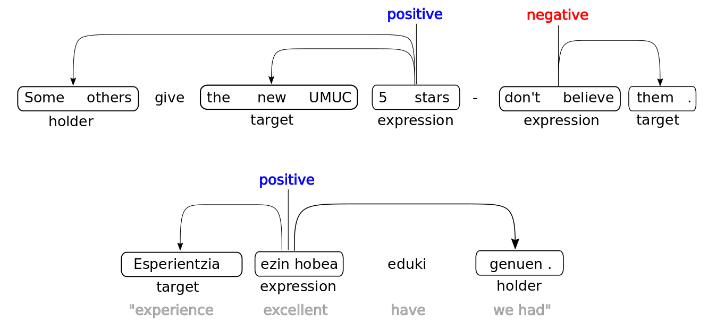

## Structured Sentiment

This Github repository hosts the data and baseline models for the SemEval-2022 shared task 10 on structured sentiment.

**Table of contents:**

1. [Problem description](#problem-description)
2. [Subtasks](#subtasks)
   1. [Track 1: Monolingual structured sentiment](#track-1:-monolingual-structured-sentiment)
   2. [Track 2: Monolingual structured sentiment](#track-2:-cross-lingual-structured-sentiment)
3. [Data and data format](#data-and-data-format)
4. [Submission via Codalab](#submission-via-codalab)
5. [Baselines](#baselines)
6. [Requirements](#requirements)
7. [Task organizers](#task-organizers)

## Problem description

The task is to predict all structured sentiment graphs in a text (see the examples below). We can formalize this as finding all the opinion tuples *O* = *O*<sub>i</sub>,...,*O*<sub>n</sub> in a text. Each opinion *O*<sub>i</sub> is a tuple *(h, t, e, p)*

where *h* is a **holder** who expresses a **polarity** *p* towards a **target** *t* through a **sentiment expression** *e*, implicitly defining the relationships between the elements of a sentiment graph.

The two examples below (first in English, then in Basque) give a visual representation of these *sentiment graphs*.



Participants can then either approach this as a sequence-labelling task, or as a graph prediction task.

## Subtasks
### Track 1: Monolingual structured sentiment
This track assumes that you train and test on the same language. Participants will need to submit results for five languages. For further information see the [data](./data) directory.

### Track 2: Cross-lingual structured sentiment
This track will explore how well models can generalize across languages.


## Data and data format

We provide the data in json lines format.

Each line is an annotated sentence, represented as a dictionary with the following keys and values:

* 'sent_id': unique sentence identifiers

* 'text': raw text

* 'opinions': list of all opinions (dictionaries) in the sentence

Additionally, each opinion in a sentence is a dictionary with the following keys and values:

* 'Source': a list of text and character offsets for the opinion holder

* 'Target': a list of text and character offsets for the opinion target

* 'Polar_expression': a list of text and character offsets for the opinion expression

* 'Polarity': sentiment label ('Negative', 'Positive')

* 'Intensity': sentiment intensity ('Standard', 'Strong', 'Slight')


```
{
    "sent_id": "../opener/en/kaf/hotel/english00164_c6d60bf75b0de8d72b7e1c575e04e314-6",

    "text": "Even though the price is decent for Paris , I would not recommend this hotel .",

    "opinions": [
                 {
                    "Source": [["I"], ["44:45"]],
                    "Target": [["this hotel"], ["66:76"]],
                    "Polar_expression": [["would not recommend"], ["46:65"]],
                    "Polarity": "Negative",
                    "Intensity": "Standard"
                  },
                 {
                    "Source": [[], []],
                    "Target": [["the price"], ["12:21"]],
                    "Polar_expression": [["decent"], ["25:31"]],
                    "Polarity": "Positive",
                    "Intensity": "Standard"}
                ]
}
```

You can import the data by using the json library in python:

```
>>> import json
>>> with open("data/norec/train.json") as infile:
            norec_train = json.load(infile)
```

## Submission via Codalab
Submissions will be handled through our [codalab competition website](https://competitions.codalab.org/competitions/33307).

## Baselines

The task organizers provide two baselines: one that takes a sequence-labelling approach and a second that converts the problem to a dependency graph parsing task.

## Requirements

1. python3
2. pytorch
3. matplotlib
4. sklearn
5. gensim
6. numpy
7. h5py
8. transformers
9. tqdm


## Task organizers

* Corresponding organizers
    * [Jeremy Barnes](https://jerbarnes.github.io/): contact for info on task, participation, etc. (<jeremycb@ifi.uio.no>)
    * [Andrey Kutuzov](https://www.mn.uio.no/ifi/english/people/aca/andreku/index.html): <andreku@ifi.uio.no>
* Organizers
    * Jan Buchman
    * Laura Ana Maria Oberländer
    * Enrica Troiano
    * Rodrigo Agerri
    * Lilja Øvrelid
    * Erik Velldal
    * Stephan Oepen


